<!--
  ───────────────────────────────────────────────────────────────
  PROFILE README  —  to render on your GitHub profile this repo
  MUST be named  Cyevil/Cyevil  (same as your username), not "rohith".
  Put header.svg in the repo root. No external services, no widgets.
  ───────────────────────────────────────────────────────────────
-->

<div align="center">



</div>

### `// brief`

> Offensive-security operator. I break web applications and Active Directory,
> build the detections that catch the same attacks, and automate the rest.
> Currently grinding OSCP and shipping a public attack/defense lab.

### `// capabilities`

```text
OFFENSIVE   web-app pentesting · exploitation · Active Directory attack paths
DEFENSE     SIEM detection engineering · incident response · threat hunting
CLOUD       Azure security · identity & access · workload hardening
TOOLING     python · playwright recon automation · custom intel pipelines
```

### `// selected work`

Curated, not dumped. Pin these four on your profile and keep the rest quiet.

- **[ad-range](#)** — Active Directory attack/defense lab; detections mapped to MITRE ATT&CK.
- **[recon-pipeline](#)** — async Python + Playwright asset-intel collector.
- **[detection-rules](#)** — Splunk / Elastic rules with tuned, documented logic.
- **[void-phantom](#)** — the cyberpunk terminal page, kept as a craft piece.

### `// contact`

**[ PORTFOLIO ](https://your-portfolio.vercel.app)**&nbsp;&nbsp;·&nbsp;&nbsp;**[ LINKEDIN ](https://linkedin.com/in/your-handle)**&nbsp;&nbsp;·&nbsp;&nbsp;**[ EMAIL ](mailto:you@example.com)**
